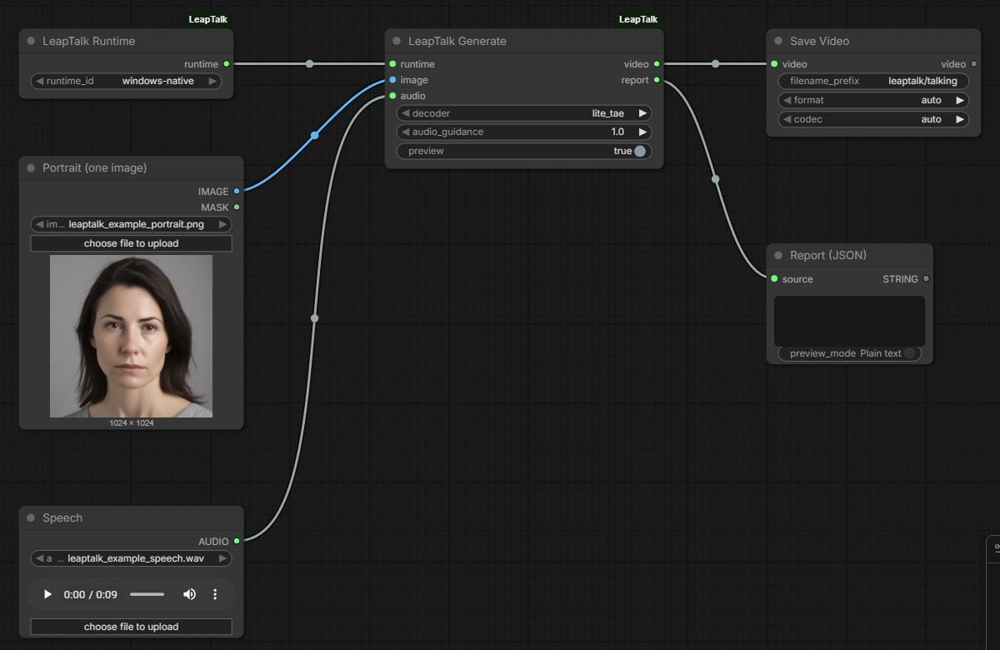

# ComfyUI-LeapTalk

**Turn a portrait and speech into a talking video locally in ComfyUI.**

Unofficial ComfyUI integration of [LeapTalk](https://github.com/zhangrongxiang/LeapTalk)
([paper](https://arxiv.org/abs/2608.00079), [project page](https://zhangrongxiang.github.io/leaptalk-page/),
[weights](https://huggingface.co/z-rx/leaptalk)), built on
[SoulX-FlashHead](https://github.com/Soul-AILab/SoulX-FlashHead) and
[wav2vec 2.0](https://huggingface.co/facebook/wav2vec2-base-960h). Not affiliated with or endorsed by the
LeapTalk authors, Soul AI Lab, Meta or Comfy Org.

日本語の概要: [README.ja.md](README.ja.md)


*AI-generated: a fictional portrait (SDXL) and synthetic speech (Kokoro-82M) animated by LeapTalk
through this node. The GIF is a reduced, silent excerpt; the MP4s with audio, the input portraits and
the input speech are in the [v0.1.0 release](https://github.com/hiroki-abe-58/ComfyUI-LeapTalk/releases/tag/v0.1.0).*

## What you get

- **LeapTalk Generate**: one portrait (`IMAGE`) + one speech clip (`AUDIO`) -> a 512x512, 25 fps
  `VIDEO` with your audio, generated chunk by chunk with the official LeapTalk recipe (1 solver step
  per chunk), plus a JSON report (frames, chunks, generator calls, timings, memory, which weights
  were applied). Previews of finished chunks appear in ComfyUI while it runs.
- **LeapTalk Runtime**: pick a runtime the administrator registered (a separate Python environment
  with the LeapTalk code and weights). Workflows cannot name programs or paths.
- **LeapTalk Doctor**: checks the runtime (pinned upstream files, model files, CUDA, attention
  backend, ffmpeg) without generating.
- **Persistent worker** (new in v0.2, opt-in): with `backend = persistent` on LeapTalk Runtime, the
  first job starts a worker that keeps the model loaded, and later queue jobs reuse it instead of
  importing and loading everything again. **LeapTalk Worker** shows it (`status`, never starts one) or
  frees it (`unload`). The old workflow and runtime configs stay one-shot.



## Results (RTX 5090, Windows 11)

- **Same frames as the official script**: for the same portrait and speech, LeapTalk's own
  `inference.py` and this node produce identical 8-bit frames (234/234 and 850/850 frames, also through
  ComfyUI's Load Audio). The LeapTalk LoRA (480/480 tensors), audio projection and ViBT scheduler are
  checked on every job.
- **Speed, one-shot** (default): a 34 s speech clip takes about 45 s from queueing to the finished
  video, a 9.4 s clip about 33–36 s; about 23 s of every job is starting the runtime and loading the
  models (mostly Python imports). Once loaded, a 28-frame chunk takes about 0.45 s (about 62 frames/s
  produced; playback is 25 fps).
- **Speed, persistent worker** (v0.2, opt-in): after the first job, further queue jobs on the loaded
  worker took **6.2 s** for the 9.4 s clip (median of 5; v0.1.0 one-shot 36.1 s) and **17.7 s** for the
  34 s clip (v0.1.0 one-shot 45.5 s), with the same frames as one-shot and as the official script. The
  first job of a worker costs the same as a one-shot job.
- **Long input**: a 96.5 s clip took 71 s one-shot and 47 s on a loaded worker; GPU memory does not
  grow with the length.
- **Memory**: peak CUDA 8.1 GiB allocated / 11.1 GiB reserved (Lite TAE), 6.1 / 7.6 GiB with the Wan
  VAE. A loaded worker keeps about 3.5 GiB of CUDA memory (about 4 GiB on the GPU) and 8.4–8.8 GiB of
  Windows commit charge while idle. On Windows, CUDA memory counts against the system commit charge; see
  docs/BENCHMARKS.md.

Details, method and limits: [docs/BENCHMARKS.md](docs/BENCHMARKS.md).

## Status

| | Scope |
| --- | --- |
| **Tested** (real weights) | Windows 11 + ComfyUI v0.38.0, runtime in a separate venv on the same Windows machine (Python 3.12, torch 2.7.1+cu128, PyTorch SDPA attention), RTX 5090 32 GB. Lite TAE decoder, audio guidance 1.0 (official defaults). Speech from 0.5 s to 96.5 s, mono and stereo, 16/24/48 kHz WAV. Generation through ComfyUI's HTTP API with `Load Image`, `Load Audio`, `Save Video`; installation from `git archive` into a differently named folder; Doctor; cancel, timeout, runtime errors and a killed ComfyUI process (no runtime process left, GPU memory back to idle). Persistent worker (v0.2): reuse over separate queue jobs (one Engine, LoRA merged once), portrait/speech/decoder changes, idle timeout, Unload, cancel/timeout/errors/a killed worker followed by a normal job, ComfyUI killed while the worker idles or generates. |
| **Tested** (CPU CI) | Ubuntu and Windows: config/job validation, audio/image hand-off, the official chunk arithmetic, process control with a fake runtime, the persistent worker protocol and lifecycle with a fake model, the memory guard with fixed measurements, node registration and execution in a real ComfyUI checkout. |
| **Experimental** | `decoder = wan_vae` (works, about 3x slower per chunk; run without `torch.compile`, while the official script compiles it). `audio_guidance` > 1 (2x generator calls; 2.0 gave visibly over-sharpened, discoloured lips in our test). |
| **Not supported** | WSL2 runtimes (planned; Windows-native was the tested path), macOS/Apple Silicon ([porting notes](docs/MACOS.md)), multi-GPU, live streaming to a viewer (the video is returned when the job ends), several portraits or speakers, sharing one worker between several ComfyUI processes. |
| **Untested** | Linux hosts with real weights (the persistent worker's Linux path is covered by CPU tests only), other GPUs, GPUs with less memory, flash-attn / SageAttention, non-English speech, speech longer than 96.5 s with real weights (`max_audio_seconds` allows up to 1800 s). |

## Install

1. Install the node: clone this repository into `ComfyUI/custom_nodes/` (no Python packages are added
   to ComfyUI).
2. Create the runtime environment, check out LeapTalk at the pinned commit and download the weights
   at the pinned revisions: [docs/SETUP.md](docs/SETUP.md).
3. Register the runtime in `ComfyUI/user/leaptalk.runtimes.json`
   (template: [examples/leaptalk.runtimes.example.json](examples/leaptalk.runtimes.example.json)),
   restart ComfyUI and run **LeapTalk Doctor**.
4. Load [workflows/leaptalk_portrait_speech.json](workflows/leaptalk_portrait_speech.json), pick your
   runtime, portrait and speech, and queue it.
5. Optional, to keep the model loaded between jobs: load
   [workflows/leaptalk_persistent.json](workflows/leaptalk_persistent.json) (LeapTalk Runtime with
   `backend = persistent`). The worker **keeps GPU and system memory while it is loaded**, also between
   jobs; it unloads after 120 s without a job (`worker_idle_seconds`), when ComfyUI exits, or with
   [workflows/leaptalk_worker_unload.json](workflows/leaptalk_worker_unload.json). Details:
   [docs/SETUP.md](docs/SETUP.md#persistent-worker-optional).

## How it works

ComfyUI writes the portrait (PNG), the speech (unchanged, as float WAV) and a schema-checked job file
into a fresh job folder and starts `runtime/leaptalk_job.py` with the runtime's Python. The runner
imports the pinned, unmodified LeapTalk checkout and follows the official `inference.py` (stream
mode):

- SoulX-FlashHead `Model_Pro` + LeapTalk LoRA (PEFT, every tensor checked, merged) + LeapTalk audio
  projection (`strict=True`, `weights_only=True`);
- the portrait resized/center-cropped to 512x512 and encoded once as the static anchor;
- the speech resampled to 16 kHz mono for wav2vec2 exactly as the official script (`librosa.load`);
- per chunk: an 8 s audio window, one ViBT step from the reference-anchored source with the clamped
  2-latent history, decode, color correction, history update by decoder round-trip, 28 new frames;
- frames streamed to ffmpeg (H.264), trimmed to `ceil(audio seconds x 25)` frames and muxed with your
  original audio (AAC, no `-shortest`); the file is decoded back and checked before it is returned.

By default every job starts a new runtime process (one-shot); about 23 s of each job is start-up. With
`backend = persistent` the same code runs in a worker process that loads the models once and then takes
one job folder at a time from ComfyUI over a local pipe (no network port); everything that belongs to a
job (portrait, speech, history, events, previews, output) is recreated per job, and the worker is
replaced when the decoder, the runtime or its files change, or after any error. A memory guard refuses
to load a model or start a job when the system commit charge is too high, and stops a job (and the
worker) when commit stays at or above 95 % (defaults; docs/SETUP.md). Processes are ended if you cancel,
if a job exceeds the runtime's timeout, or if ComfyUI goes away.

Security and trust model: [docs/SECURITY.md](docs/SECURITY.md). Tests: [docs/TESTING.md](docs/TESTING.md).

## Licenses

This repository: Apache License 2.0. LeapTalk code and weights, SoulX-FlashHead and wav2vec2 are
installed separately under their own terms (Apache License 2.0 as published; the Lite decoder file is
the MIT-licensed TAEHV checkpoint). Component table and the demo material provenance:
[docs/LICENSING.md](docs/LICENSING.md).

Use portraits and voices only with the rights and consent of the people shown and heard, and label
generated videos as AI-generated.

## Registry

Comfy Registry node id `leaptalk` (publisher `hiroki-abe-58`); see the release notes for the current
review state.

## Citation

If you use LeapTalk, cite the paper:

```bibtex
@misc{zhang2026leaptalkbreakinglatencyqualitytradeoff,
      title={LeapTalk: Breaking the Latency-Quality Trade-off in Talking Head Generation},
      author={Rongxiang Zhang and Songhua Liu},
      year={2026},
      eprint={2608.00079},
      archivePrefix={arXiv},
      primaryClass={cs.CV},
      url={https://arxiv.org/abs/2608.00079},
}
```

and SoulX-FlashHead, which LeapTalk builds on:

```bibtex
@misc{yu2026soulxflashheadoracleguidedgenerationinfinite,
      title={SoulX-FlashHead: Oracle-guided Generation of Infinite Real-time Streaming Talking Heads},
      author={Tan Yu and Qian Qiao and Le Shen and Ke Zhou and Jincheng Hu and Dian Sheng and Bo Hu and Haoming Qin and Jun Gao and Changhai Zhou and Shunshun Yin and Siyuan Liu},
      year={2026},
      eprint={2602.07449},
      archivePrefix={arXiv},
      primaryClass={cs.CV},
      url={https://arxiv.org/abs/2602.07449},
}
```
