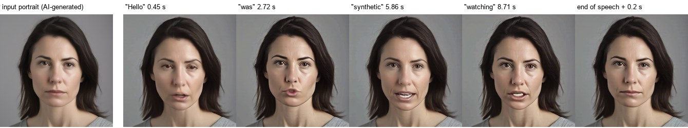
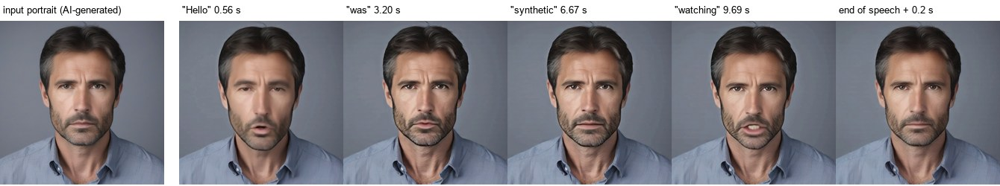
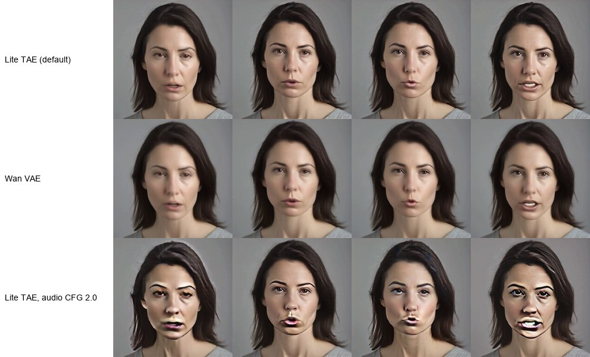

# Benchmarks, comparison and evaluation

Everything below is from one machine, one day (2026-10-03), with the setup in docs/SETUP.md. Raw
records: `docs/results/gpu_e2e_report.json` (v0.1.0 ComfyUI HTTP end-to-end), `docs/results/reference_check.json`
(official script vs this package), `docs/results/quality_eval.json` (frame review and automatic
proxies), `docs/results/demo_manifest.json` (v0.1.0 demo inputs and outputs), `docs/results/v020/`
(v0.2.0: one-shot vs persistent worker, see [Persistent worker](#persistent-worker)).

## Setup

| | |
| --- | --- |
| GPU | NVIDIA GeForce RTX 5090 32 GB, driver 595.95, shared with the Windows desktop (about 2.4 GB in use at idle) |
| Host | Windows 11, 64 GB RAM, ComfyUI v0.38.0 (CPU-only PyTorch in ComfyUI's own venv) |
| Runtime | separate venv on the same Windows machine: Python 3.12.13, torch 2.7.1+cu128, diffusers 0.38.0, transformers 4.57.3, PEFT 0.19.1; attention: PyTorch SDPA (no flash-attn / SageAttention); no torch.compile |
| Upstream | LeapTalk `5d8fef8`, unmodified |
| Weights | z-rx/leaptalk `b33b788` (LoRA, `audio_proj_step_10400.pt`, `taew2_1.pth`), SoulX-FlashHead-1_3B `59119b6` (`Model_Pro`, `VAE_Wan`), wav2vec2-base-960h `22aad52` |
| Recipe | official defaults: 1 solver step per chunk (ViBT, shift 5), audio guidance 1.0, 33-frame window, 2 history latents (5 overlap frames), 28 new frames per chunk, 25 fps, 512x512, bf16, history update by decoder round-trip, color correction 1.0, Lite TAE decoder |
| Inputs | two fictional portraits (SDXL) and English speech (Kokoro-82M) made for this test, see docs/LICENSING.md |

## What runs (checked on every job)

- **Base**: SoulX-FlashHead-1_3B `Model_Pro` (`WanModelAudioProject`, bf16).
- **LeapTalk LoRA**: 480/480 checkpoint tensors present in the model and loaded with their exact
  values (r 64, alpha 64, q/k/v/o of self- and cross-attention in all 30 blocks), then merged
  (relative change of `blocks.0.self_attn.q.weight`: 0.156). The published LoRA has plain keys (no
  `._orig_mod.`), so the official script does not force `torch.compile`; this package does not compile
  either.
- **LeapTalk audio projection**: `audio_proj_step_10400.pt` loaded with `strict=True` and
  `weights_only=True`; values verified (relative change of `proj1.weight` vs the base model: 0.638).
- **Scheduler**: `ViBTScheduler` with timesteps `[1000]` (1 step; with one step the stochastic term is
  exactly 0, so the output does not depend on a seed), the reference-anchored source and the clamped
  history prefix of `_bridge_sample_one_chunk`.
- **Decoder**: LeapTalk Lite TAE (`taew2_1.pth`, TAEHV) or, optionally, the Wan2.1 VAE.
- **Generator calls**: 1 per chunk at audio guidance 1.0 (2 per chunk with audio CFG > 1), counted.

## Same frames as the official script

The official `inference.py` was run unchanged in a single process (`--compile off
--num_inference_steps 1 --lite`, which is what `inf.sh` with `torchrun --nproc_per_node=1` runs without
multi-GPU) with observation-only hooks recording every frame passed to its video writer.

| Input | Official frames | This package (direct) | This package through ComfyUI (clean install) |
| --- | --- | --- | --- |
| portrait A + 9.35 s speech | 252 written, MP4 cut to the audio by `-shortest` | first 234 frames **identical** (uint8, before encoding) | 234/234 **identical** |
| portrait B + 33.98 s speech | 868 written | – | 850/850 **identical** |

The package keeps `ceil(audio seconds x 25)` frames (the official script writes all generated
frames and lets ffmpeg's `-shortest` cut them) and muxes the original audio as AAC instead of MP3.
The MP4 bytes therefore differ; the generated frames do not. The ComfyUI path includes ComfyUI's
`LoadAudio` decoding and this package's float WAV hand-off, so that path is exact too.

## Speed (RTX 5090, Windows native runtime)

Through ComfyUI's HTTP API, one job per queue item (each job starts the runtime process and loads
the models), clean install:

| Speech | Output frames | Chunks | Queue -> done (wall) | Wall / audio seconds |
| --- | --- | --- | --- | --- |
| 0.5 s | 13 | 2 | 30.3 s | – |
| 9.35 s (A) | 234 | 9 | 34.7 s | 3.7 |
| 10.40 s (B) | 260 | 10 | 30.3 s | 2.9 |
| 30.78 s (A) | 770 | 28 | 40.3 s | 1.31 |
| 33.98 s (B) | 850 | 31 | 43.4 s | 1.28 |
| 96.5 s | 2414 | 87 | 70.6 s | 0.73 |

Where the time goes (runtime process, 34 s clip): Python imports 18.6 s (torch, diffusers,
transformers, PEFT, xfuser, mediapipe on Windows), model load 2.3 s (warm file cache; 6.0 s cold),
LoRA load + merge 1.1 s, reference encode 0.2 s, chunk loop 15.7 s, encoder finalize 0.2 s, output
check 0.5 s.

Per chunk (28 new frames, mean over chunks 3+ as the official script reports):

| | Lite TAE | Wan VAE | Lite TAE, audio CFG 2.0 |
| --- | --- | --- | --- |
| audio encoding (wav2vec2 over the 8 s window) | 0.013 s | 0.013 s | 0.012 s |
| generator (1 step) | 0.358 s | 0.359 s | 0.714 s (2 calls) |
| decode | 0.049 s | 0.830 s | 0.048 s |
| color correction + history round-trip | 0.011 s | – | 0.011 s |
| frame conversion + hand-off to the encoder | 0.058 s | 0.061 s | 0.059 s |
| **chunk total** | **0.43 s** | **1.28 s** | **0.79 s** |
| generation throughput | about 65 frames/s | about 22 frames/s | about 36 frames/s |

The output plays at 25 fps; "frames/s" is how fast frames are produced once the models are loaded,
not the end-to-end time of a job. These numbers are not comparable with the paper's figures (other
GPU, other measurement).

No streaming to a viewer is implemented: the video is returned when the job ends. While it runs, the
last frame of each finished chunk is sent to the ComfyUI client as a progress preview. Measured over
ComfyUI's websocket for the 30.8 s clip: the first preview arrived 24.0 s after queueing (start-up plus
the first chunk), then one per chunk about every 0.5 s (28 previews), and the finished video 39.6 s
after queueing.

## Memory

| | Lite TAE | Wan VAE |
| --- | --- | --- |
| CUDA after model load (allocated / reserved) | 3.2 / 3.4 GiB | 3.2 / 3.4 GiB |
| CUDA peak in the chunk loop (allocated / reserved) | 8.1 / 11.1 GiB | 6.1 / 7.6 GiB |
| whole GPU (incl. ~2.4 GB desktop) | 14.5 GB | – |
| runtime process tree RSS (peak, direct run) | about 5.1 GiB | – |

The peak does not grow with the length of the speech (frames are streamed to the encoder chunk by
chunk; a 96.5 s clip used the same peak). The Lite TAE decodes all frames of a chunk at once, which is
the peak; the Wan VAE path uses about 3.5 GiB less GPU memory but is about 3x slower per chunk.

**Windows commit charge.** On this Windows machine, CUDA memory counted against the system commit
charge almost 1:1 (WDDM). With ComfyUI and the runtime running, commit rose from about 73 % to a peak
of 92–93 % of the 93.3 GB commit limit, with other desktop applications open. If your commit charge
is already high, close other GPU applications first or use `decoder = wan_vae`. These are observed
peaks for this configuration, not minimum requirements.

## Persistent worker

v0.2.0 adds `backend = persistent`: the first job starts a worker that imports LeapTalk, loads the
models and merges the LoRA once; later queue jobs reuse that Engine. Measured through ComfyUI's HTTP
API on the same machine and day as above, with a test ComfyUI started with `--cache-none` (every
queued prompt really executes; nothing is served from ComfyUI's output cache), `Load Image` +
`Load Audio` -> **LeapTalk Generate** (Lite TAE, audio guidance 1.0, previews on) -> `Save Video`
(MP4, streams copied). "Wall" is queueing the prompt to ComfyUI reporting it finished. The v0.1.0
column is `git archive v0.1.0` installed alone in the same test ComfyUI and driven by the same script
(`scripts/gpu_worker_e2e.py`); v0.1.0 and v0.2.0 never had a model loaded at the same time. The
model files were read many times before these runs (warm OS file cache); no run here is "disk cold".

| Speech | v0.1.0 one-shot | v0.2.0 one-shot | v0.2.0 persistent, first job | persistent, warm jobs | v0.1.0 one-shot / warm | Frames | Memory (worker loaded / job peak) |
| --- | --- | --- | --- | --- | --- | --- | --- |
| 9.35 s (A), 234 frames | 36.1 s (31.8–40.4, n=3) | 32.6 s (32.2–33.5, n=3) | 30.4 s | **6.2 s** (5.8–8.2, n=5) | 5.8x | identical in all 12 runs (= official script) | CUDA 3.5 / 11.1 GiB reserved |
| 33.98 s (B), 850 frames | 45.5 s (43.9–47.4, n=3) | 45.3 s (44.0–46.6, n=2, see below) | 42.7 s | **17.7 s** (17.3–18.1, n=5) | 2.6x | identical in all 11 runs (= official script) | CUDA 3.5 / 11.1 GiB reserved |

Values: median (range, number of runs). Raw values per run: `docs/results/v020/comparison_table.json`.
The difference between the v0.1.0 and v0.2.0 one-shot columns is within their spread (same code path
for generation; v0.2.0 adds only bookkeeping). Queue wall per second of speech: one-shot 3.5 (9.35 s)
and 1.33 (33.98 s), persistent warm 0.67 and 0.52. Generation itself is unchanged: 0.45 s per 28-frame
chunk (about 62 frames/s produced, playback 25 fps), so warm jobs are now mostly chunk loop.

Where the time goes:

| | first persistent job (33.98 s) | warm job (33.98 s, median) |
| --- | --- | --- |
| worker start: imports | 19.0 s | – (paid once per worker) |
| model load, LoRA load + merge, audio projection | 2.4 + 1.2 + 0.2 s | – |
| start-up total (spawn to ready, measured in ComfyUI) | 23.2 s | – |
| job on the worker (audio load, reference encode, chunk loop, encoder finalize, output check) | 19.3 s | 17.6 s (chunk loop 16.0 s) |
| queue to finished video | 42.7 s | 17.7 s |

The first job pays the same start-up as a one-shot job (it is the same work); a worker started again
after an Unload, the idle timeout or a decoder change pays it again (22.5–23.0 s start-up measured for
decoder changes, 22.7–23.2 s after an Unload). The job timings in the report contain only the job's own
time; the worker's initialization time is reported once (`engine_init_timings` in the Worker status)
and never added to later jobs.

**Same output.** For every input tried, one-shot and persistent jobs gave identical 8-bit frames
(SHA-256 over all frames before encoding): portrait A 9.35 s and portrait B 33.98 s match the official
script's frames (`reference_check.json`); B 10.40 s, A 30.78 s, stereo 48 kHz, 0.5 s, 3 s of silence and
96.5 s ran on one worker; `wan_vae` gave the same frames persistent and one-shot. A fresh worker and the
tenth job of a warm worker gave the same frames for the same input. This is equality of the frames
handed to the encoder for these inputs on this machine, not a general bit-exactness guarantee.

**No state carried between jobs.** Ten jobs on one worker (A 9.35 s, B 10.40 s, A 9.35 s, A 30.78 s,
B stereo 48 kHz, A 0.5 s, B silence, B 33.98 s, A 9.35 s, B 10.40 s), then a 96.5 s job: one worker id,
one Engine id, the Engine counters stayed at `init 1, lora_merge 1, audio_proj_load 1` while
`jobs_started` went from 1 to 10, one generator call per chunk in every job, and each portrait gave its
own frames again (A -> B -> A: A's hash both times). The progress previews ComfyUI received belonged to
the running job: the last preview of each prompt differed from that job's own `preview.jpg` by 0.13–0.14
(mean absolute difference of 0–255 values, JPEG re-encoding) and from the previous job's by 42–43 when the
portrait changed.

What is kept and what is reset:

| Kept for the worker's lifetime (one Engine) | Recreated for every job |
| --- | --- |
| imported LeapTalk / SoulX-FlashHead modules, the `Model_Pro` weights with the LoRA merged once, the audio projection, wav2vec2, the decoder | the job folder, `job.json` validation, events and cancel flag, the portrait encoding and reference latents, the history/motion latents, audio features, the generator state of the pipeline (`prepare_params` state is dropped before and after each job), ffmpeg, CUDA peak statistics; afterwards unused CUDA cache is released (`empty_cache` is not an unload) |

Before every job the worker checks that its model files (size, modification time), the pinned upstream
files and a fingerprint of four merged weight tensors are unchanged; anything else (decoder, runtime
settings, package scripts) changes the worker identity and starts a new worker.

**Memory.** Resident while loaded and idle: CUDA 3.2 GiB allocated / 3.5 GiB reserved, about 4.0 GiB of
GPU memory in use by the worker (nvidia-smi, on top of the desktop's 2.4 GiB), 1.9–2.6 GiB resident set
and 7.9 GiB private bytes in the worker process; the system commit charge was 8.4–8.8 GiB higher than
with ComfyUI alone. A job adds the same peak as a one-shot job (CUDA 8.1 GiB allocated / 11.1 GiB
reserved in the chunk loop; 14.0 GiB in use on the whole GPU); after each job the worker returned to the
same 3.46 GiB reserved and 1.9 GiB resident set and the system commit to 80.4–80.6 GiB, flat over the
ten-job sequence (the same warm condition repeated, no growth). An Unload or the idle timeout returned
commit and GPU memory to the ComfyUI-only level (72.6 GiB commit, 2.4 GiB on the GPU = the desktop).

**The memory guard on this machine.** The commit limit is 93.3 GiB; with the desktop applications that
were open and the test ComfyUI, the baseline was 71.6–73.0 GiB, so a LeapTalk job peak (about 16.5 GiB
of commit, one-shot or persistent) reached 94.5–95.5 % of the limit. With the default guard
(docs/SETUP.md) this means:

- warm jobs ran when the loaded worker left room for the measured job peak plus 25 % below 97 %; when
  the background was about 0.5 GiB higher they were refused before starting ("commit would reach about
  97.3 %"), with the worker kept;
- when commit stayed at or above 95 % for 5 s during a job, the job and the worker were stopped with that
  message and the next job started a new worker. During development, earlier versions of the stop rule
  kept the timer running while commit dipped just under 95 % (down to 93 %, then 94.5 %) and stopped
  every 33.98 s job, including the cold first job of each new worker; the released rule counts only time
  continuously at or above 95 %, and with it the 33.98 s benchmark above completed 6 of 6 jobs;
- the test harness applied the same rule to one-shot jobs (which have no guard, as in v0.1) and
  interrupted one of three v0.2.0 one-shot runs of the 33.98 s clip at 95.3 %; that run is excluded from
  the one-shot column above.

These defaults are deliberately conservative for this 64 GB workstation. If your commit charge is high,
close other applications, use `decoder = wan_vae` (job peak about 3.5 GiB lower) or, if you accept the
risk, adjust `memory_guard` in the runtime config.

**Clean install.** The release commit, installed with `git archive` into a folder named
`LeapTalk clean v0.2 ü` as the only LeapTalk package of the test ComfyUI, queued its shipped API
workflows (only the runtime id and input file names replaced). Lite TAE: the v0.1 workflow (one-shot) and
the first job of `leaptalk_persistent.json` gave the official frames, Status and Unload worked; the
following warm jobs were refused by the memory guard at that moment (the background commit charge had
grown by about 0.6 GiB; projected 97.2–97.4 % against the 97 % limit), with the worker kept and a clear
message. The same workflows with `decoder = wan_vae`: the v0.1 workflow one-shot, then
`leaptalk_persistent.json` three times on one worker (portrait A, B, A; 38.6 s, 15.6 s, 14.1 s; A's frames
identical both times and equal to the one-shot result; the workflow's Worker status node reported the
idle worker after each job), Status, Unload, and ComfyUI killed while a worker idled (gone after 1.2 s).
Records: `docs/results/v020/clean_install_*.json`.

### All attempts

The speed table above uses completed jobs only. Every generation queued in the v0.2.0 GPU runs
(`docs/results/v020/`), with its outcome:

| Run | Attempted | Completed | Refused before start (memory guard) | Stopped by the memory guard | Cancelled / timeout / error (intended test) | Interrupted by the test harness |
| --- | --- | --- | --- | --- | --- | --- |
| one-shot vs persistent, sequence, 96.5 s (Lite TAE) | 31 | 23 | 1 | 6 (stop rule of a development version) | – | 1 |
| 33.98 s benchmark, decoder switch, cancel, error | 17 (+1 not in the record*) | 14 | (1*) | 1 | 1 cancel, 1 error | – |
| timeout, crash, idle, Unload, race, kill (`wan_vae`) | 12 | 10 | – | – | 1 timeout, 1 crash | – |
| clean install, Lite TAE | 8 | 3 | 5 | – | – | – |
| clean install, `wan_vae` | 5 | 5 | – | – | – | – |

\* The run was stopped by hand after a warm Lite TAE job was refused (projected 97.3 %); that attempt is
not in its record file. A first v0.2.0 run (not included) was discarded because the test harness's own
memory watchdog interrupted a one-shot job.

Lite TAE on this machine: the warm jobs that ran peaked at 94.3–94.8 % of the commit limit; whether a job
ran, was refused or was stopped depended on the background load at that moment, and the 33.98 s benchmark
completed 6 of 6 only after the stop rule was corrected. `wan_vae` peaked lower (85.4–85.7 GiB of commit,
about 92 %) and was not refused in these runs.

**Failure handling (real runs, persistent backend).** Cancel during a job: stopped between chunks, the
worker was kept, the next job ran on it. Job timeout (`timeout_minutes = 1`, 96.5 s with `wan_vae`):
`LeapTalk job exceeded 60 s`, cancelled cleanly. Missing model folder: the worker failed to start with
the runtime's message, nothing left running. Worker interpreter killed during a job: the job failed with
"the worker exited unexpectedly", all five worker processes were gone, the next job started a new
worker. Worker launcher killed while idle (the interpreter survived it): the idle check (every second)
noticed and ended the remaining processes through the job object within the 15 s the test waited; the
next job started a new worker. Idle timeout (15 s in the test
runtime): unloaded 17.3 s after the job; Status polls did not extend it. Prompts queued at once
(generate, generate, Unload, Status, generate): at most one worker at any time, the first two jobs on
the same worker, a new one after the Unload. ComfyUI killed hard while the worker idled and while it
generated: every worker process (launcher, interpreter, ffmpeg) was gone after 1.0 s and 1.4 s, GPU
memory back to the desktop level. Raw records: `docs/results/v020/`.

## Output review

All four portrait/speech combinations (2 portraits x a ~10 s and a ~30 s script) were reviewed frame by
frame at word timings, plus the 0.5 s clip, 3 s of silence, a stereo 48 kHz input and a 96.5 s clip.
How: frames at the start/middle of the first word, two words in the middle, the last word and 0.2 s
after the end of speech, chunk-boundary frame pairs, and the first vs last frame. Nobody listened to
the outputs; the speech fixtures were checked with ASR instead (word error rate 3–6 %).

- The mouth moves from the first word ("Hello" at 0.3–0.5 s); the last word ("watching", "Goodbye")
  is visible with open mouth shapes; the mouth closes after the end of speech. Rounded vowels ("for",
  "open") show rounded lips.
- Identity stays stable over 34 s and 96.5 s (first vs last frame mean difference 3–4 of 255); blinks
  and small head motion appear.
- Chunk boundaries: the frame-to-frame change at a boundary averages 2.2–3.2 (of 255) vs 1.4–1.8
  inside chunks, maximum 6.3. That is a small measurable step; no visible seam in the reviewed pairs.
- Automatic proxy (not a lip-sync metric): correlation between mouth-region change and speech energy
  per frame 0.14–0.32 at a lag of 0–1 frames; mouth-region change is larger during speech than in
  silence (19.6–21.4 vs 14.0–17.9).
- Audio guidance 2.0 (experimental): strong artifacts (over-sharpened, discoloured lips, exaggerated
  features). Keep the default 1.0.
- Silence produces a mostly still, closed-mouth face; the 0.5 s clip gives 13 frames.

These are observations on two synthetic portraits and two synthetic voices, not a quality benchmark.
